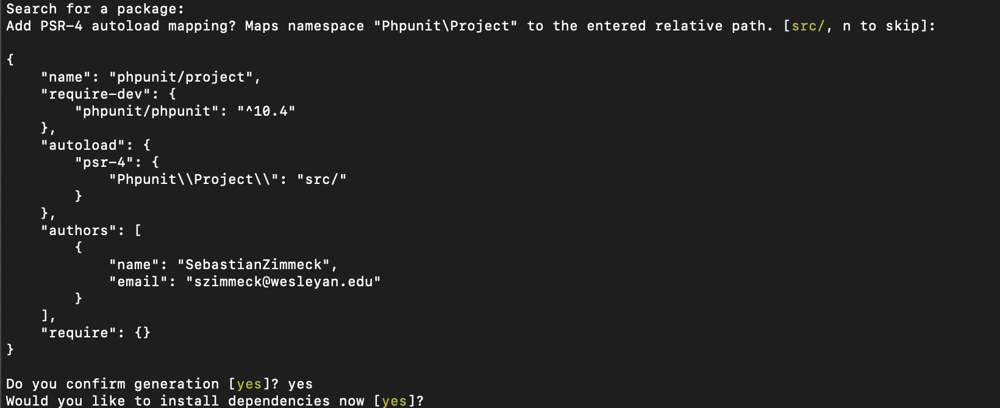

# Unit Testing Using Jest and PHPUnit

## 2. PHPUnit backend unit tests

The backend unit tests are based on [PHPUnit](https://docs.phpunit.de),
a unit testing framework for PHP files. PHPUnit can be installed through
[Composer](https://getcomposer.org). Additionally, [Guzzle](https://guzzle3.readthedocs.io),
which is also available via Composer, is needed to simulate HTTP client requests.

Here is the detailed setup (for macOS):

1. If you do not have it yet, install [homebrew](https://brew.sh/) with:

   ```bash
   /bin/bash -c "$(curl -fsSL https://raw.githubusercontent.com/Homebrew/install/HEAD/install.sh)"
   ```

2. Install PHPUnit with:

   ```bash
   brew install phpunit
   ```

3. Install Composer with:

   ```bash
   brew install composer
   ```

4. If necessary, you can install PHP with:

   ```bash
   brew install php
   ```

5. In the root folder of your music rating backend code, which contains your
   `index.php`, create a new folder, say, `test-project` (the name does not matter).
   From inside `test-project` folder start Composer by running:

   ```bash
   composer init
   ```

   Make the choices shown as follows (for the most part, hit enter). When asked
   if you would like to define your dev dependencies, accept the prompt and
   type `phpunit/phpunit`. Once issue that you could come with is composer init doesn't download eveything initially as the following images portray, and this issue is because it creates a 'composer.json' file in the directory where you ran the prompt, and this file might need to be modified a little. In the "name" section, you might need to change it to something like:

   ```json
   "name": "darlingrodriguez/backendtests",
   ```

   

   

   

   

   

6. Install Guzzle with:

   ```bash
   composer require guzzlehttp/guzzle
   ```

7. Once you have finished the Composer config, create a new folder called `tests`
   in your `test-project`. The `tests` folder will be the place where your PHP
   test files live.

8. Once you have written your tests, you can start your Apache server and SQL
   database in XAMPP, which your tests interact with. Make sure to check the port
   number of your server (note, server and database have different port numbers).
   In your PHP test files, include your port numbers as necessary in the test
   requests to your backend.

   

   Be sure to include any other values in the test files to make them fit the
   database you are using (e.g., the database name you used in PHPMyAdmin). Also,
   a deletion test will not run properly unless you give it a real
   value to work with. The same is true for update unit tests. So, make sure
   that your database is set up accordingly.

9. From within the `test-project` folder you can run your unit tests with:

   ```bash
   php vendor/bin/phpunit tests
   ```

   This will run the full test suite and output the test results to the terminal.

## 3. Jest frontend unit tests

Create your frontend unit tests using [Jest](https://jestjs.io/), a unit
testing framework for Javascript and React.

1. Unit testing with Jest will require you to include files in different places
   of your existing React app fronted. Thus, it is a good idea to make a local
   copy of your app to experiment with it.
2. Jest comes included with React, however, you can install it at the root folder
   of your copied repo to make sure:

   ```bash
   npm install --save-dev jest @testing-library/react @testing-library/jest-dom
   ```

3. Navigate to the root folder of your frontend, where you keep your
   `package.json`, and place the files in the `Config_Files` there (note, you
   may not need to use the `Config_Files` or use [different ones](https://jestjs.io/docs/configuration);
   these are the ones we used, and you can try them as well).
4. Place your unit test files in the `views` folders they relate to. For example,
   your login unit tests would go into the folder of your login view. If your
   login view is named `login.js`, your related test file would be named
   `login.test.js`.
5. Run your tests from within your frontend root folder with:

   ```bash
   npm run test
   ```

   You should now see that all tests for your Jest test suite pass.
