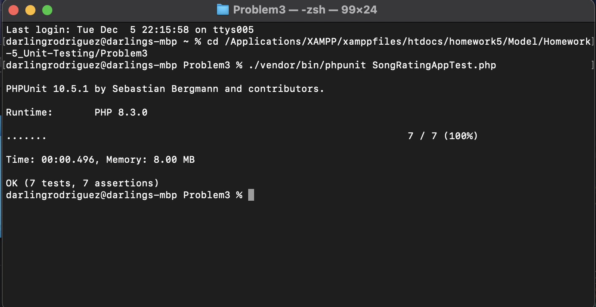
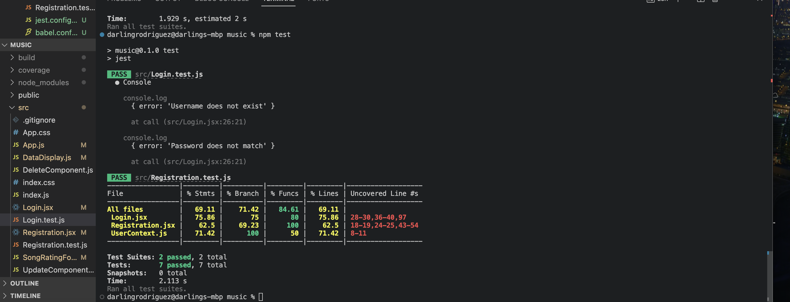

# Homework-5_Unit-Testing
# Darling Rodriguez & Lily Edelman - Software Engineering @ Wesleyan University

This is a full-stack React Native application made under the course COMP333: Software Engineering. The idea of this project is to create an application where users can log in, upload songs, and rate them, as well as view songs rated by other users in the community. This application makes user for CRUD opearations by utilizing the backend RESTApi and connecting it with the front-end. This mainly focuses on integrating unit testing for both front end and backend of the application

# Problem 1

The function testing for this problem can be found under the Problem1 folder.


# Problem 2

## Local Set Up

Before we get this unit testing to work, we need to download the framework pytest that we use in this unit test.

```bash
pip3 install pytest
```

With this crucial framework installed, you can now download the files inside the Problem 2 folder and through the terminal, navigate to that directory.
The main file with unit tests is the 'Unit_testing_pytest.py' file that links with the 'unit_testing_sample_code.py' file that includes the function we want to test. 

Once in the directory, we want to run the following command to run the unit tests:

```bash
pytest -v
```


# Problem 3

## Local Set Up

In order to test whether our backend files are functional through testing, we first need to make sure we can host these files. Look back to the [Homework 3](https://github.com/lilyicecream/homework3) ReadMe on setting up XAMPP and phpMyAdmin and the testing database before continuing.

Inside the 'Backend_Test' folder is included all of the backend files necessary to add in the htdocs folder inside XAMPP. 

In order to get the php testing file 'SongRatingAppTest.php' to work, in the same directory where the file is downloaded, open the terminal to that directory and do the following instructions inside the 'Php_install_instructions' folder and go through the 'testing-setup' file.

Once all the dependencies are installed, we can start modifying our testing file so it works locally on your computer. Inside the 'SongRatingAppTest' testing file and throughout the backend files, you will see urls like these:
```php
$this->http = new Client(['base_uri' => 'http://129.133.185.148/homework5/']);
```

We use our local IP address to reach our files, followed by the name of the main directory of the backend files inside XAMPP. You can change this to your local computer's information.

In order to find out what your IP adress is, one way to find out on a MacOs, is to go to a terminal window and running the line:

```bash
ifconfig
```

You will get a load of text, make sure to find the 'en0' and right next to 'inet' you will see your IP, such as 'inet 129.133.185.148'

Once everything is downloaded, modified, and placed in the correct places, we can test our PHP test file by running the following command from within the directory where the 'SongRatingAppTest.php' test file is at:
```bash
./vendor/bin/phpunit SongRatingAppTest.php
```

One thing to keep a note of is the test input in the files we provided were probably already ran and could cause a fail if ran again. For example, the input in the "testPost_updateSong()" test function could not pass if the input isn't being changed every time is is being ran. Else, it should all pass as such:

 

# Problem 4

## Local Set Up

In order to get problem 4 working, we first need to set up our React app locally. Navigate to a directory where you would like to place your React app and then through the terminal, run the following prompt:

```bash
npx create-react-app myReactNameApp
```
Now that your React application is downloaded, we can replace all of the files inside of the src folder and replacing them with our src folder files inside of the Problem 4 folder. After this step, we can now naviagte inside the src folder through our terminal, and we will now install Jest to test the front end. There are instructions in the 'testing-setup.md' file but you should run the command:

```bash
npm install --save-dev jest
```
As well as Babel:

```bash
npm install --save-dev babel-jest @babel/core @babel/preset-env
```

After following these two crucial steps, make sure that they produced 2 additional files in your React app, a 'jest.config.js' and a 'babel.config.js', both of which are in our repo that you should copy and paste to the ones in your app to make it run.

Additionally, our React App makes use of a package called Axios that you should install inside the React app directory through your terminal by running the command:

```bash
 npm install axios
```

Finally, from the react files that we have in our repo, most of them have lines with links such as:

```jsx
 axios.get(`http://localhost/homework5/Controller/RestApi/Ratings/Read_ratings.php`)
```

This shows how we are connecting our frontend with the backend files that we talked about in problem 3. For it to work correctly, we change our IP from problem 3, to localhost, followed by the folder name in which you stored the backend files in the XAMPP htdocs folder. Additionally, make sure to change the 'Access-Control-Allow-Origin' from the IP to local host. For example:

```php
header("Access-Control-Allow-Origin: http://129.133.185.148");
```

to 

```php
header("Access-Control-Allow-Origin: http://localhost");
```

for the ones with IP already there.


Within the files, our test files are the [Login.test.js](./Problem4/src/Login.test.js) and [Registration.test.js](./Problem4/src/Registration.test.js) files. In order to run these tests, you can run the following command:

```bash
  npm run test
```

If everything ran correctly, which it did on our side, you should see all passing tests, as such:

 


# Problem 5


# Problem 6

While we did not use generative AI, there are many ways that it could aid the testing of our app.

One use of generative AI would be to generate test cases to cover a wide variety of scenarios that humans would miss.  For example, it can efficiently create a large number of examples to be tested or used as data for the tests.  This saves a lot of time for the developers of the app.

It could also be used to suggest edits to previously developed test for an app.  It could inform the developer of any scenarios they did not cover in their tests, any syntax or logical issues in the code, or any unintended outcomes from the code.

In addition, it can run tests to check the efficiency and overall success of the app.  It could replace other softwares to do accessibility and usability testing.

It could also test the security level of the app and any faults there might be in the current security measures.

These are some examples of ways that generative AI could aid the testing of our music rating app.
